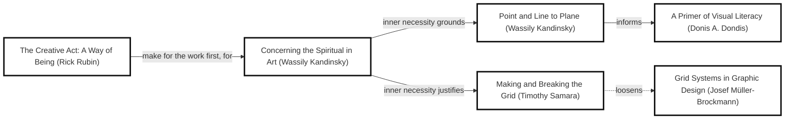
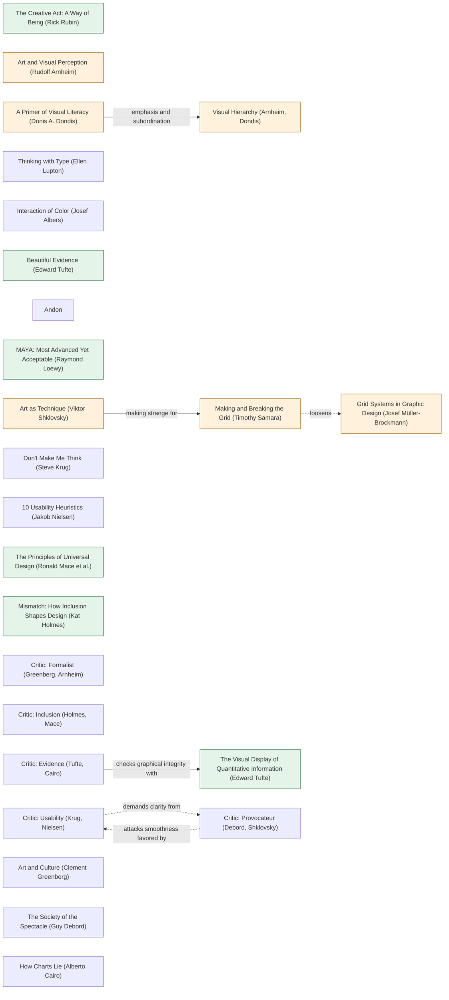
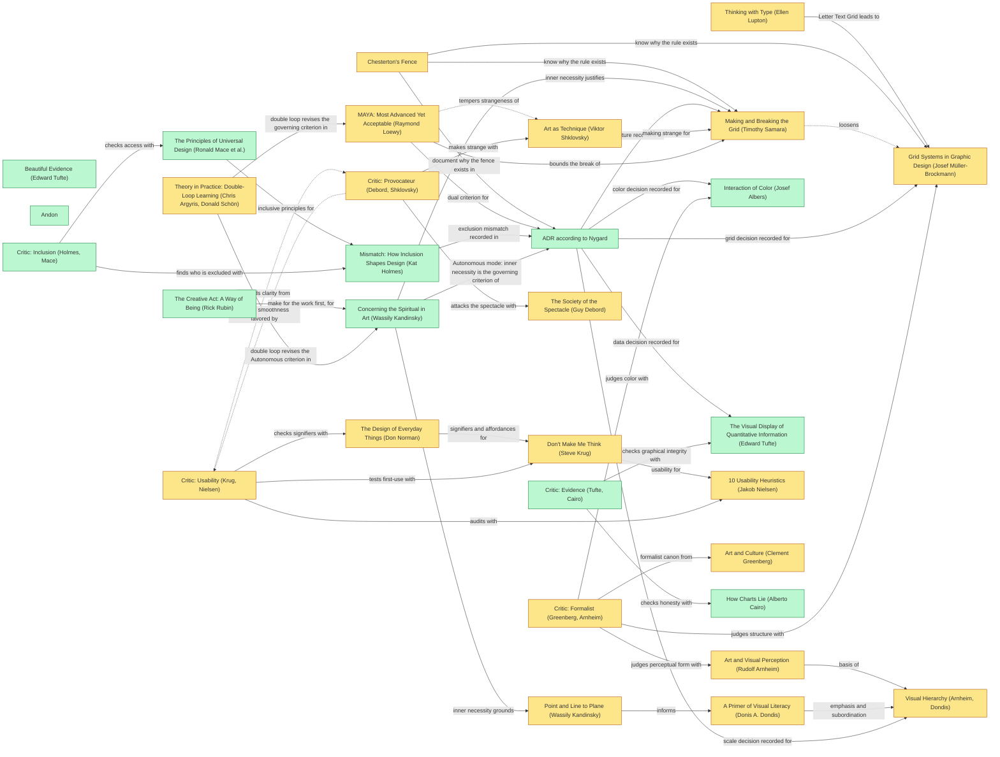
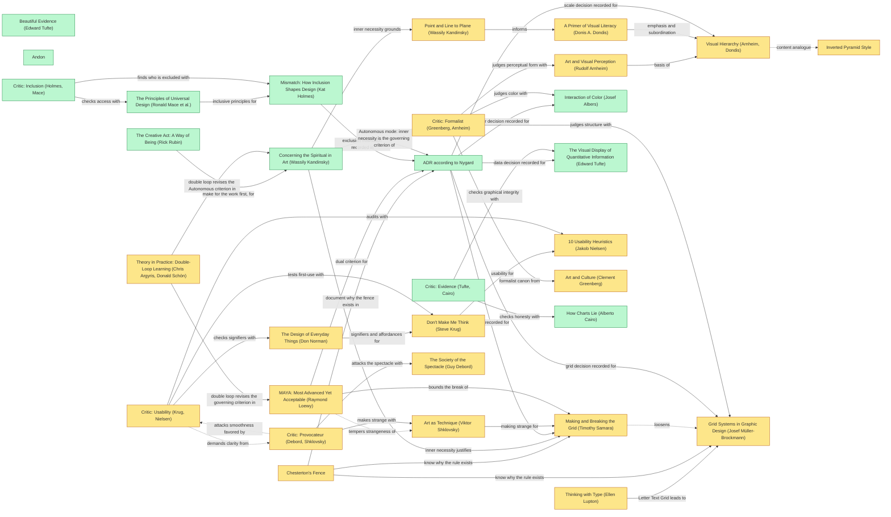

# Freddie GUI design log

## Traversal Plan

Brief: use DADA to make Freddie’s entire GUI as good as it can possibly be, retaining real session behavior while raising visual ambition, clarity, accessibility and responsiveness.

Mode: Adaptive. Freddie serves people conducting agent work; the advanced pole and acceptable pole must both hold under MAYA: Most Advanced Yet Acceptable (Raymond Loewy). No move quota.

Skill: /config/workspace/gdaa/skills/dada/SKILL.md. The sibling gdaa DESIGN-LOG.md concerns its own public website and is not this GUI’s design record.

Tooling inventory: gm MCP for instruction/PRD workflow state, codeinsight and codesearch, source edits and native live execution; gm cdp for rendered artifact inspection; collaboration agents for independent critics; Markdown for persistence. No dedicated diagram renderer or graph database in the available tool catalog: the marked Mermaid graph below is the rendering fallback; executable graph parsing computes the initial Frontier. Polaris Goal Compiler, Fifth-Dimension Engine and WFGY-Method define atoms, route and drift checks.

Seed chain: The Creative Act: A Way of Being (Rick Rubin) —make for the work first, for→ Concerning the Spiritual in Art (Wassily Kandinsky) —inner necessity grounds→ Point and Line to Plane (Wassily Kandinsky) —informs→ A Primer of Visual Literacy (Donis A. Dondis). Breaker: Concerning the Spiritual in Art (Wassily Kandinsky) —inner necessity justifies→ Making and Breaking the Grid (Timothy Samara) ⋯loosens→ Grid Systems in Graphic Design (Josef Müller-Brockmann). Labels and edges are copied from the actual reference graph.

Panel: Critic: Provocateur (Debord, Shklovsky); Critic: Inclusion (Holmes, Mace); Critic: Formalist (Greenberg, Arnheim); Critic: Usability (Krug, Nielsen); Critic: Evidence (Tufte, Cairo). Each critic is a distinct agent. Provocateur ⋯attacks smoothness favored by→ Usability, and Usability ⋯demands clarity from→ Provocateur provide the dotted dissent pair.

Atoms and gates: A1 rendered baseline plus source/live ownership audit; A2 independently criticized bounded design moves with records written before mutation; A3 integration across populated/empty sessions, navigation, history, composer, settings and narrow/desktop layouts; A4 deliberate ambition push and saturation. A2 depends on A1, A3 on settled moves, A4 on integration. A parallel gm transport repair is active because the first native browser launch failed without DISPLAY; supported attachment to existing Chrome is configured. Claim ceiling: only observed behavior and renders count, no hardware-performance claims from software rendering, no full completion without all DADA stop conditions.

Route: preserve the existing functional GUI as the recoverable checkpoint at efdbebb7326926cd1844061bb8343feb0653fdcc; use live observations to select the strongest visual/interaction move. Compare distinct bold branches when more than one Breaker is plausible; compare against actual task affordances. Open debt: baseline critics, design moves, browser interaction verification, all S1–S5.

### Living graph

## Frontier

| Candidate | Reached via (edge label, direction) | From anchor | Status |
|---|---|---|---|
| Steal Like an Artist (Austin Kleon) | stance companion to; outgoing | The Creative Act: A Way of Being (Rick Rubin) | DEFERRED: compare native alternatives directly without borrowing another identity |
| Ways of Seeing (John Berger) | attention to seeing echoes; outgoing; dotted | The Creative Act: A Way of Being (Rick Rubin) | DEFERRED: real-session viewing questions covered by current critics; no separate image campaign |
| A Primer of Visual Literacy (Donis A. Dondis) | informs; outgoing | Point and Line to Plane (Wassily Kandinsky) | TAKEN M4; title and metric hierarchy |
| Principles of Form and Design (Wucius Wong) | systematizes; outgoing | A Primer of Visual Literacy (Donis A. Dondis) | DEFERRED: Dondis/Arnheim suffice for reading/control hierarchy |
| Visual Hierarchy (Arnheim, Dondis) | emphasis and subordination; outgoing | A Primer of Visual Literacy (Donis A. Dondis) | TAKEN M2/M4/M5; outcomes and prose |
| International Typographic Style (Swiss Style) | codifies; outgoing | Grid Systems in Graphic Design (Josef Müller-Brockmann) | DEFERRED: retain established type system while changing category rhythm |
| Geometry of Design (Kimberly Elam) | proportion for; incoming | Grid Systems in Graphic Design (Josef Müller-Brockmann) | DEFERRED: content and viewport constraints ground widths; no ornamental proportion |
| Thinking with Type (Ellen Lupton) | Letter Text Grid leads to; incoming | Grid Systems in Graphic Design (Josef Müller-Brockmann) | TAKEN M4; readable wrapping |
| Bauhaus Principles (Gropius, Moholy-Nagy, Albers) | taught; incoming | Point and Line to Plane (Wassily Kandinsky) | DEFERRED: seed plane/line grammar suffices without replacing component system |
| Dreyfus Model of Skill Acquisition | expert stage breaks; incoming | Making and Breaking the Grid (Timothy Samara) | DEFERRED: no inferred skill level; beginner access retained |
| Chesterton's Fence | know why the rule exists; incoming | Grid Systems in Graphic Design (Josef Müller-Brockmann) | TAKEN M5 alignment/inspectability fences |
| Chesterton's Fence | know why the rule exists; incoming | Making and Breaking the Grid (Timothy Samara) | TAKEN M5 alignment/inspectability fences |
| Grid Systems in Graphic Design (Josef Müller-Brockmann) | loosens; outgoing; dotted | Making and Breaking the Grid (Timothy Samara) | TAKEN M4/M7/M8; owner-container alignment |
| Ways of Seeing (John Berger) | visual literacy critique for; incoming | A Primer of Visual Literacy (Donis A. Dondis) | DEFERRED: real-session viewing questions covered by current critics; no separate image campaign |
| Bibliographic: 100 Classic Graphic Design Books (Jason Godfrey) | includes; incoming | Grid Systems in Graphic Design (Josef Müller-Brockmann) | DEFERRED: reference catalog supplies no separate observable GUI candidate |
| Point and Line to Plane (Wassily Kandinsky) | inner necessity grounds; outgoing | Concerning the Spiritual in Art (Wassily Kandinsky) | TAKEN seed and M5 rhythm grounding |
| Making and Breaking the Grid (Timothy Samara) | inner necessity justifies; outgoing | Concerning the Spiritual in Art (Wassily Kandinsky) | TAKEN M5A/M5B BREAK comparison |
| ADR according to Nygard | grid decision recorded for; incoming | Grid Systems in Graphic Design (Josef Müller-Brockmann) | TAKEN pre-move records; alternatives and consequences |
| ADR according to Nygard | rupture recorded for; incoming | Making and Breaking the Grid (Timothy Samara) | TAKEN pre-move records; alternatives and consequences |
| Art as Technique (Viktor Shklovsky) | making strange for; incoming | Making and Breaking the Grid (Timothy Samara) | TAKEN M5 interrupted process/prose rhythm |
| MAYA: Most Advanced Yet Acceptable (Raymond Loewy) | bounds the break of; incoming | Making and Breaking the Grid (Timothy Samara) | TAKEN governing Adaptive criterion |
| Critic: Formalist (Greenberg, Arnheim) | judges structure with; incoming | Grid Systems in Graphic Design (Josef Müller-Brockmann) | TAKEN R1/R5 independent critique |
| Critic: Rupture (Shklovsky, Marinetti) | breaks the grid with; incoming | Making and Breaking the Grid (Timothy Samara) | DEFERRED: Adaptive Provocateur already tests rupture independently |
| Critic: Significant Form (Bell, Fry) | tests inner necessity with; incoming | Concerning the Spiritual in Art (Wassily Kandinsky) | DEFERRED: Formalist covers form; redundant panel vote |
| Critic: Musical Structure (Hanslick, Pater) | tests rhythm with; incoming | Point and Line to Plane (Wassily Kandinsky) | DEFERRED: current Formalist/Provocateur test process/prose rhythm |
| Critic: Non-Objective (Malevich, Mondrian) | tests abstraction with; incoming | Point and Line to Plane (Wassily Kandinsky) | DEFERRED: task language and controls must stay representational |
| The Non-Objective World (Kazimir Malevich) | non-objective lineage for; outgoing | Concerning the Spiritual in Art (Wassily Kandinsky) | DEFERRED: abstraction would erase task meaning |
| Art (Clive Bell) | significant form complements; incoming | Concerning the Spiritual in Art (Wassily Kandinsky) | DEFERRED: autonomous form does not replace Adaptive usability criterion |
| Concerning the Spiritual in Art (Wassily Kandinsky) | make for the work first, for; outgoing | The Creative Act: A Way of Being (Rick Rubin) | TAKEN seed; purpose before polish |
| ADR according to Nygard | Autonomous mode: inner necessity is the governing criterion of; outgoing | Concerning the Spiritual in Art (Wassily Kandinsky) | TAKEN pre-move records; alternatives and consequences |
| CRITICS | Autonomous mode: judge each move against; incoming | Concerning the Spiritual in Art (Wassily Kandinsky) | TAKEN five-role panel R1; WHOLE repeat pending |
| Theory in Practice: Double-Loop Learning (Chris Argyris, Donald Schön) | double loop revises the Autonomous criterion in; incoming | Concerning the Spiritual in Art (Wassily Kandinsky) | TAKEN R1 and M3 frame swaps; final double-loop pending |

| Narrow navigation access | Existing universal-design critique; interaction incoming | Mismatch: How Inclusion Shapes Design (Kat Holmes) | TAKEN M6; independent R5 PASS |
| Settings content width | Existing universal-design critique; interaction incoming | The Principles of Universal Design (Ronald Mace et al.) | TAKEN M7; independent R5 PASS |
| Model/Details recovery | audits with; outgoing | Critic: Usability (Krug, Nielsen) | OPEN |
| Timeline measure and scope | checks graphical integrity with; outgoing | Critic: Evidence (Tufte, Cairo) | TAKEN M3; graphical R5 and native action-frame R7 PASS |
| Session identity and metrics | emphasis and subordination; outgoing | A Primer of Visual Literacy (Donis A. Dondis) | TAKEN M4; independent R5 PASS, whole integration OPEN |
| Work score versus work dossier | making strange for; incoming | Making and Breaking the Grid (Timothy Samara) | TAKEN M5A/M5B; comparative spikes active |
| Composer input responsiveness | audits with; outgoing | Critic: Usability (Krug, Nielsen) | OPEN; native input and empty/active integration evidence required |
| Empty workspace and desktop Details | signifiers and affordances for; incoming | The Design of Everyday Things (Don Norman) | OPEN; real-state discovery and reopen behavior |
| Final whole-artifact integration | emphasis and subordination; outgoing | Visual Hierarchy (Arnheim, Dondis) | OPEN; five critics after branch comparison |
| Ambition push | making strange for; incoming | Art as Technique (Viktor Shklovsky) | OPEN; escalate winning BREAK before saturation |

## Decision Records

M1 and M2 records precede their source changes; further moves follow the live Frontier.

## Panel Reports

Baseline WHOLE R1 and targeted re-reviews appear below. Full integration remains OPEN.

## Anchor Ledger

| Anchor | Role | Status | Evidence | Replacement or note |
|---|---|---|---|---|
| Inverted Pyramid Style | M2/M5A frame-swap counterpoint | ADAPT | R8 five critics rejected hidden operation/reason; supplied result now occupies the wrapping first reading position, with operation name beneath. Independent native re-review pending. | Reached by Visual Hierarchy dotted content analogue |
| The Creative Act: A Way of Being (Rick Rubin) | Design/critique | KEEP | R1 rejected activity-first foreground despite quiet styling. Purpose-first stance retained through M2 concrete outcome titles; decorative novelty alone was declined. | M5 must make task purpose visible |
| Art and Visual Perception (Rudolf Arnheim) | Design/critique | ADAPT | Strongest R1 objection: equal title/event weight and undifferentiated rows. M4 readable title/metrics pass independent R5; M5 rhythm remains under comparison. | Preserve category structure and test its interaction in WHOLE |
| A Primer of Visual Literacy (Donis A. Dondis) | Design/critique | ADAPT | Strongest R1 objection: equal title/event weight and undifferentiated rows. M4 readable title/metrics pass independent R5; M5 rhythm remains under comparison. | Preserve category structure and test its interaction in WHOLE |
| Visual Hierarchy (Arnheim, Dondis) | Design/critique | ADAPT | Strongest R1 objection: equal title/event weight and undifferentiated rows. M4 readable title/metrics pass independent R5; M5 rhythm remains under comparison. | Preserve category structure and test its interaction in WHOLE |
| Grid Systems in Graphic Design (Josef Müller-Brockmann) | Design/critique | ADAPT | Strongest R1 objection: equal title/event weight and undifferentiated rows. M4 readable title/metrics pass independent R5; M5 rhythm remains under comparison. | Preserve category structure and test its interaction in WHOLE |
| Thinking with Type (Ellen Lupton) | Design/critique | ADAPT | Strongest R1 objection: equal title/event weight and undifferentiated rows. M4 readable title/metrics pass independent R5; M5 rhythm remains under comparison. | Preserve category structure and test its interaction in WHOLE |
| Interaction of Color (Josef Albers) | Design/critique | KEEP | R1 asked that accents serve selection and outcomes rather than every category. Existing neutral palette retained while M2 changes readable outcome text; dark Settings independently fits. | Whole color/hierarchy interaction pending |
| Making and Breaking the Grid (Timothy Samara) | Design/critique | ADAPT | Strongest R1 objection: routine process repetition conceals consequences. M2 owner outcomes pass; M5A/M5B now render alternative interruptions. | Independent BREAK comparison and ambition push pending |
| The Visual Display of Quantitative Information (Edward Tufte) | Design/critique | KEEP | Survived M2 objection that summary might invent transport errors: unchanged isError/raw fields and raw-only search independently verified. M3 measured scale and partial scope pass R5. | M3 action semantics and WHOLE integration remain separately open |
| Beautiful Evidence (Edward Tufte) | Design/critique | KEEP | Survived M2 objection that summary might invent transport errors: unchanged isError/raw fields and raw-only search independently verified. M3 measured scale and partial scope pass R5. | M3 action semantics and WHOLE integration remain separately open |
| Andon | Design/critique | KEEP | Survived pressure to make a stylistic BREAK before usable access: M5 held through native navigation/Settings/menu failures; corresponding independent releases recorded. | Any new Andon stops new moves |
| MAYA: Most Advanced Yet Acceptable (Raymond Loewy) | Design/critique | ADAPT | R1 showed acceptable-looking density without sufficient clarity or ambition. Repairs establish access; actual M5 alternatives test the advanced pole. | No balance or whole PASS claimed yet |
| Art as Technique (Viktor Shklovsky) | Design/critique | ADAPT | Strongest R1 objection: routine process repetition conceals consequences. M2 owner outcomes pass; M5A/M5B now render alternative interruptions. | Independent BREAK comparison and ambition push pending |
| Don't Make Me Think (Steve Krug) | Design/critique | ADAPT | Strongest R4 objection: clipped title/model and undiscoverable scrolling metrics. M4 wraps title/groups; M8 fit/focus independently passes. | M3 named-action verification and whole composer review pending |
| 10 Usability Heuristics (Jakob Nielsen) | Design/critique | ADAPT | Strongest R4 objection: clipped title/model and undiscoverable scrolling metrics. M4 wraps title/groups; M8 fit/focus independently passes. | M3 named-action verification and whole composer review pending |
| The Principles of Universal Design (Ronald Mace et al.) | Design/critique | KEEP | Survived actual clipped navigation, narrow Settings and menu exclusion: M1/M6/M7/M8 independent native bounds, focus and Escape checks pass. | Whole interaction and empty-state review pending |
| Mismatch: How Inclusion Shapes Design (Kat Holmes) | Design/critique | KEEP | Survived actual clipped navigation, narrow Settings and menu exclusion: M1/M6/M7/M8 independent native bounds, focus and Escape checks pass. | Whole interaction and empty-state review pending |
| Critic: Formalist (Greenberg, Arnheim) | Design/critique | ADAPT | Strongest R1 objection: equal title/event weight and undifferentiated rows. M4 readable title/metrics pass independent R5; M5 rhythm remains under comparison. | Preserve category structure and test its interaction in WHOLE |
| Critic: Inclusion (Holmes, Mace) | Design/critique | KEEP | Survived actual clipped navigation, narrow Settings and menu exclusion: M1/M6/M7/M8 independent native bounds, focus and Escape checks pass. | Whole interaction and empty-state review pending |
| Critic: Usability (Krug, Nielsen) | Design/critique | ADAPT | Strongest R4 objection: clipped title/model and undiscoverable scrolling metrics. M4 wraps title/groups; M8 fit/focus independently passes. | M3 named-action verification and whole composer review pending |
| Critic: Provocateur (Debord, Shklovsky) | Design/critique | ADAPT | Strongest R1 objection: routine process repetition conceals consequences. M2 owner outcomes pass; M5A/M5B now render alternative interruptions. | Independent BREAK comparison and ambition push pending |
| Critic: Evidence (Tufte, Cairo) | Design/critique | KEEP | Survived M2 objection that summary might invent transport errors: unchanged isError/raw fields and raw-only search independently verified. M3 measured scale and partial scope pass R5. | M3 action semantics and WHOLE integration remain separately open |
| Art and Culture (Clement Greenberg) | Design/critique | ADAPT | Strongest R1 objection: equal title/event weight and undifferentiated rows. M4 readable title/metrics pass independent R5; M5 rhythm remains under comparison. | Preserve category structure and test its interaction in WHOLE |
| The Society of the Spectacle (Guy Debord) | Design/critique | ADAPT | Strongest R1 objection: routine process repetition conceals consequences. M2 owner outcomes pass; M5A/M5B now render alternative interruptions. | Independent BREAK comparison and ambition push pending |
| How Charts Lie (Alberto Cairo) | Design/critique | KEEP | Survived M2 objection that summary might invent transport errors: unchanged isError/raw fields and raw-only search independently verified. M3 measured scale and partial scope pass R5. | M3 action semantics and WHOLE integration remain separately open |
| Concerning the Spiritual in Art (Wassily Kandinsky) | Seed rationale | KEEP | Purpose-first criterion retained through R1 raw-event hierarchy frame swap; ornamental ambition alone did not answer five objections. | M5 must make purpose visible |
| Point and Line to Plane (Wassily Kandinsky) | Seed rule | ADAPT | Uniform event rhythm failed R1; M5 uses actual category boundaries for different visual rhythm. | M5A/M5B comparison pending |
| The Design of Everyday Things (Don Norman) | Interaction frame | ADAPT | M3 partial toggle state failed native review; use a named action and current-measure caption. | Native action review pending |
| Chesterton's Fence | Rule boundary | ADAPT | M5 preserves alignment within categories, exact chronology and original disclosures; grouping must earn its inspection cost. | Branch comparison pending |
| ADR according to Nygard | Decision method | KEEP | Survived R1 need for a frame swap: original Decision Records remain, with alternatives, consequences and superseded scope rather than erased history. | Every further move requires a pre-move record |
| Theory in Practice: Double-Loop Learning (Chris Argyris, Donald Schön) | Frame revision | ADAPT | R1 changed primary hierarchy from raw activity to recorded outcomes; M3 changed incomplete toggle semantics to named action. | Final criterion/panel/graph amendment pending |

## Compliance Check

Incomplete. Tooling inventory, mode, exact seed and initial graph/frontier are recorded. Moves, independent panels, objection resolutions, ambition push, two stable WHOLE rounds, dotted-edge disposition, final ledger and double-loop amendment remain open.

WFGY checkpoint: convergent; browser repair enables evidence rather than replacing the full GUI objective. Previous goal-turn classification is unavailable in this compacted context; current source inspection newly establishes that prior trajectory work may already be committed and must be re-witnessed.

## Move M1: Reach every conversation view and name the rail action (KEEP-THE-RULE)

Depends on: none.
Anchors: Stance The Creative Act: A Way of Being (Rick Rubin) | Rules A Primer of Visual Literacy (Donis A. Dondis), Grid Systems in Graphic Design (Josef Müller-Brockmann) | Breaker Making and Breaking the Grid (Timothy Samara) | Counterpoint Grid Systems in Graphic Design (Josef Müller-Brockmann), dotted loosens edge from Making and Breaking the Grid (Timothy Samara). Grounding: Mismatch: How Inclusion Shapes Design (Kat Holmes), The Principles of Universal Design (Ronald Mace et al.).
Intent: keep the full view vocabulary reachable in a bounded narrow strip, and keep Settings identifiable when its visible label collapses.
Formal argument: the settled390px DOM proves Trajectory outside451px, tablist overflow visible inside clipping parents; the rail Settings button has no text/name. A native scrollable tab strip preserves the established grid while making its overflow navigable; localized visually hidden text preserves the action identity without adding visual noise.
Alternatives rejected: wrapping every tab makes header height grow and reduces transcript space; removing tabs or replacing them with unlabeled icons loses navigation clarity; a hardcoded Settings aria-label breaks locale ownership.
Consequence: tabstrip can scroll independently on small displays; each tab remains fixed-size, and focus styling must fit the scrollport. Rail text stays in accessibility tree and follows locale.
Fence: bounded header and rail reduce chrome; they must not hide destinations or names. No BREAK in this move.
Frontier effect: keyboard/touch tab reachability; narrow session-title/mode relationship; Settings modal keyboard loop.
Advanced pole: Making and Breaking the Grid (Timothy Samara) remains pending as a purpose-driven outcome hierarchy move; this move earns a reliable scaffold. Acceptable pole: The Principles of Universal Design (Ronald Mace et al.) through reachable navigation and named controls.
Verification gate: real390px and320px renders; native focus scroll reveals Trajectory; every tab activates; Settings icon keeps localized accessible text, opens/closes actual modal and returns focus.

Baseline panel records: Evidence OBJECT/Andon on hidden GM operation outcomes and timeline scale/scope, grounded in How Charts Lie (Alberto Cairo), The Visual Display of Quantitative Information (Edward Tufte); Formalist OBJECT on uniform hierarchy/rhythm grounded in Art and Visual Perception (Rudolf Arnheim), Grid Systems in Graphic Design (Josef Müller-Brockmann), Interaction of Color (Josef Albers), Art and Culture (Clement Greenberg); Provocateur OBJECT on routine treatment of repeated/blocked episodes grounded in The Society of the Spectacle (Guy Debord), Art as Technique (Viktor Shklovsky); Inclusion OBJECT/Andon on clipped Trajectory and unnamed Settings, grounded in Mismatch: How Inclusion Shapes Design (Kat Holmes), The Principles of Universal Design (Ronald Mace et al.). Statements of meaning: quiet inspectable work ledger, activity overwhelms consequence. Artist questions: are work/outcomes legible and navigation reachable? Neutral questions: what scale/scope is shown, what reveals failure or repetition, which element leads, how does narrow view expose every destination? Root permits opinions after meaning/questions. Inclusion mobile composer objection is withdrawn against settled native DOM (sidebar56, textarea292); initial resize screenshot was transient, not proof of a persistent defect. Usability report pending. No new stylistic move until both Andons are resolved.

### Panel WHOLE baseline, round R1

Artifacts examined: .gm/witness/gui-dada-baseline-desktop.png, gui-dada-chat-desktop.png, gui-dada-chat-mobile-settled.png; Evidence also exercised actual history and read durable tool result nodes; Inclusion inspected settled live390px DOM. Five independent agents; no critic read another verdict.

| Critic | Anchor used | Observed in the work | Verdict | Requested change |
|---|---|---|---|---|
| Critic: Provocateur (Debord, Shklovsky) | The Society of the Spectacle (Guy Debord); Art as Technique (Viktor Shklovsky) | Repeated gm_git_log attempts/context rows receive routine equal visual treatment; blocked push has no corresponding emphasis | OBJECT | Evidence-backed action episodes and visible interruptions for recorded repetition/blockage |
| Critic: Inclusion (Holmes, Mace) | Mismatch: How Inclusion Shapes Design (Kat Holmes); The Principles of Universal Design (Ronald Mace et al.) | Settled390px Trajectory ends451.11px with clipped ancestors, tablist overflow visible; Settings rail has no accessible text/name | OBJECT | Reachable scrollable views, explicit localized Settings name; native keyboard witness |
| Critic: Formalist (Greenberg, Arnheim) | Art and Visual Perception (Rudolf Arnheim); Grid Systems in Graphic Design (Josef Müller-Brockmann); Interaction of Color (Josef Albers); Art and Culture (Clement Greenberg) | Title, tabs and event text compete at similar scale; uninterrupted separators and category marks conceal meaningful grouping | OBJECT | Strong session identity, stable event columns and turn rhythm, accent reserved for selection/outcomes |
| Critic: Usability (Krug, Nielsen) | Don't Make Me Think (Steve Krug); 10 Usability Heuristics (Jakob Nielsen) | Desktop named navigation works; mobile title/model and footer clip; consequential outcome requires decoding technical rows | OBJECT | Full navigation/model identification; adaptive metrics; concise understandable outcomes with detail disclosure |
| Critic: Evidence (Tufte, Cairo) | How Charts Lie (Alberto Cairo); The Visual Display of Quantitative Information (Edward Tufte); Beautiful Evidence (Edward Tufte) | Failed GM operations have isError:false (successful transport), raw previews start with irrelevant metadata; lane scale and history scope unclear; native history owners74→146 retained | OBJECT | GM-owned outcome labels without inventing transport failures; scale/units and loaded range scope |

Statements of meaning: quiet information-rich conversation and inspectable work ledger; activity receives more emphasis than consequence. Artist questions: is complex work legible/honest, is form purposeful, can people navigate without internal decoding? Neutral questions: how do mobile readers discover every view/model, what defines lane extent and partial-history scope, what distinguishes attempted work from achieved outcomes, and where is the visual center? Opinions: root permits them after meaning and questions. Andon: Inclusion and Evidence; access and outcome repairs precede new stylistic moves. Three critics share the outcome/hierarchy region objection, requiring a frame swap: replace raw-event-first foregrounding with evidence-backed outcomes, grounded by existing crit_evid→tufteV (checks graphical integrity with), crit_use→nielsen (audits with), crit_prov→shklovsky (makes strange with) edges. Original raw-event rhythm is SCRAP as the primary hierarchy, retained under disclosure for audit. No source move yet; repairs are being proven.

## Move M2: GM outcomes lead inspection (KEEP-THE-RULE)

Depends on: none; interacting with M1 at mobile integration.
Anchors: Stance The Creative Act: A Way of Being (Rick Rubin) | Rules A Primer of Visual Literacy (Donis A. Dondis), Visual Hierarchy (Arnheim, Dondis) | Breaker Making and Breaking the Grid (Timothy Samara) | Counterpoint Grid Systems in Graphic Design (Josef Müller-Brockmann), dotted loosens edge from Making and Breaking the Grid (Timothy Samara). Further grounding How Charts Lie (Alberto Cairo), The Visual Display of Quantitative Information (Edward Tufte), 10 Usability Heuristics (Jakob Nielsen).
Intent: make a refused or failed GM operation legible before opaque metadata while leaving every original result available to inspect.
Formal argument: live gm_git_log seq1001 and gm_git_push seq1013 expose canonical top-level GM ok:false/error/reason/gate_denied inside isError:false successful tool transport. The GM tool owner understands its reply; its result presenter supplies a concise generic title, consumed by generic Chat and Trajectory presenters. Tufte/Cairo demand truthful state, so isError and raw result remain authoritative and unchanged.
Alternatives rejected: interpret any nested ok:false as a failure (unsupported domain heuristic); convert GM domain refusals into transport errors (changes executor/replay semantics); reorder arbitrary JSON globally (breaks unrelated tool contracts).
Consequence: known GM failures gain concise native summaries during replay; existing specialized renderers take precedence; unknown payloads retain raw fallback. Generic title consumption can affect other tools and needs actual caller review.
Fence: event rows preserve provenance; a summary supplements rather than erases payload.
Frontier effect: GM error/gate-denied/success/unknown-payload cases, raw inspector fidelity, lane scale/scope and outcome-oriented grouping.
Advanced pole: Art as Technique (Viktor Shklovsky) enables a later evidence-backed interruption rather than decorative strangeness; Acceptable pole: 10 Usability Heuristics (Jakob Nielsen) through visible outcomes and preserved disclosure.
Status: implemented; independent source and rendered review pending. The unrelated inherited HMR mutable remains unknown under its original owner and explicitly deferred as externally blocked; its status is not GUI evidence.

### M2 adjacent workflow finding

Live historical failures exposed a current product-adapter defect: tool-gm schemas instruct max_count and git_show object, while current canonical daemon accepted_fields requires limit and rev. The presentation repair makes this cost visible; repairing the registered adapter prevents new calls from repeating it. Owner tool-gm updates schema/current contract from actual daemon evidence, without rewriting historical events or adding undocumented aliases. Tracked as gm-freddie-adapter-canonical-fields-20261007; separate execution evidence required. This is workflow repair, not the required artistic BREAK or a reason to close the full GUI goal.

### M1 ADAPT before source refinement

Native trusted Input.dispatchKeyEvent Tab from Files to Trajectory at390px produced focused tab x310.64–371.11 inside strip x76–362, scrollLeft0 and visible2px outline. Automatic browser focus reveal does not fully reveal a partially visible tab. Inclusion objection remains valid. Add an owner-local focus handler using native scrollIntoView({block:nearest, inline:nearest}); no smooth motion, provider changes or synthetic keyboard inference. Preserve the current scrollable strip and localized rail name. Re-run native Tab/ShiftTab/Enter at390/320 and render before Inclusion re-review.

### Panel M1, rounds R2 and R3

Artifacts: .gm/witness/gui-dada-m1-mobile.png, gui-dada-m1-keyboard320.png and live DOM. Independent Critic: Inclusion (Holmes, Mace). Statements of meaning: compact navigable conversation. Artist asks whether each destination and Settings identity remain reachable. Neutral question: does native focus reveal the whole control? Opinions permitted. R2 OBJECT under Mismatch: How Inclusion Shapes Design (Kat Holmes): native focus only partly reveals the trailing tab; ADAPT with nearest scrollIntoView and4px scroll padding, rerender. R3 PASS under The Principles of Universal Design (Ronald Mace et al.):320px Trajectory227.64–288.11 inside76–292, native Enter activates, Settings localized name retained, native Escape returns focus. Inclusion Andon released for this move; crowded header remains OPEN. No dependent moves yet.

M2 execution: canonical daemon git_log {limit:1} and git_show {rev:HEAD,stat:true} return real HEAD. Live HMR loads the changed GM adapter and client presenters. Reloaded actual recorded replies show GM failed/GM refused summaries in Chat and Trajectory; the inspector retains raw ok:false, reason/error, accepted_fields and durable isError:false. Artifacts: .gm/witness/gui-dada-m2-chat-outcomes.png and gui-dada-m2-trajectory-inspection.png. Standard registered executor invocation remains unwitnessed; canonical daemon execution and historical presentation are distinct evidence. Six NUL characters in layout.js are inherited unchanged from HEAD, not introduced by this move.

### Frontier update after M1 R3

Navigation candidate TAKEN M1. Outcome diagnostics TAKEN M2, independent review OPEN. Header/model/footer narrow hierarchy OPEN; timeline scale and loaded-history scope OPEN; purposeful outcome rhythm BREAK branches OPEN; cluster integration OPEN; broad empty/workspace/Settings/dark/keyboard audit OPEN; native composer responsiveness witness OPEN; ambition push OPEN; whole saturation OPEN. Initial theory neighbours are retained pending explicit dispositions.

## Move M3: Name the timeline measure and loaded scope (KEEP-THE-RULE)

Depends on: M2 for outcome summaries; existing timeline ownership remains unchanged.

Anchors: Stance The Creative Act: A Way of Being (Rick Rubin) | Rules A Primer of Visual Literacy (Donis A. Dondis), The Visual Display of Quantitative Information (Edward Tufte) | Breaker Making and Breaking the Grid (Timothy Samara) | Counterpoint Grid Systems in Graphic Design (Josef Müller-Brockmann), dotted loosens from Making and Breaking the Grid (Timothy Samara). Further grounding How Charts Lie (Alberto Cairo).

Intent: let readers see which measurement determines horizontal length and how much recorded history is loaded.

Formal argument: the actual146-node snapshot has145 timed nodes; record order spans146, compressed-idle duration261117ms, wall time264353ms, point time251792ms. Tufte requires units and scope; Cairo forbids a completeness implication from a partial window. Use authoritative domain extents and hasMore, never manufacture elapsed times or missing history.

Alternatives rejected: keep the generic Duration label (false for record-order mode); assume every event has timing (one lacks it); imply session-wide coverage from the loaded domain (hasMore:true).

Consequence: added caption and edge scale consume a little chrome but make lane comparison interpretable; labels follow actual selected mode.

Fence: terse compact timeline controls preserve room for data; the caption must wrap at narrow widths and not obscure interactions.

Frontier effect: timed/untimed modes, partial/complete loaded history, scale legibility on mobile, detail inspector interaction with composer.

Advanced pole: Beautiful Evidence (Edward Tufte) integrates annotations with dense data. Acceptable pole: 10 Usability Heuristics (Jakob Nielsen) makes system state visible.

## Move M4: Give the session identity its own narrow-screen line (KEEP-THE-RULE)

Depends on: M1.

Anchors: Stance The Creative Act: A Way of Being (Rick Rubin) | Rules Visual Hierarchy (Arnheim, Dondis), Thinking with Type (Ellen Lupton) | Breaker Making and Breaking the Grid (Timothy Samara) | Counterpoint Grid Systems in Graphic Design (Josef Müller-Brockmann), dotted loosens from Making and Breaking the Grid (Timothy Samara).

Intent: make the session title the header’s visual center and keep secondary controls and metrics legible when space narrows.

Formal argument: baseline390px title competes with mode/log controls and collapses to a few characters; footer hides its metric line. Lupton’s text/grid relationship and visual hierarchy require clear precedence. Owner-local container queries give the title a full first line below520px; controls occupy a compact second line. Metrics use a horizontally scrollable row preserving composer height, and its keyboard access reveals all text.

Alternatives rejected: hide mode/log controls (removes meaningful destinations); shrink all type (weakens legibility); let metrics wrap to many rows (pushes transcript off small screens).

Consequence: narrow headers gain one line, with readable session identity and stable composer height. Desktop remains one line. Metric row gains native keyboard focus/scroll only when needed, with full accessible content. Model identification will be evaluated separately because the existing trigger already supplies a full native title and accessible name.

Fence: chrome is bounded to protect work area; added height must earn its space and leave navigable tabs.

Frontier effect: nested sessions/long titles, sidebar resizing, footer scrolling/native input identity, desktop/narrow cluster integration.

Advanced pole: Visual Hierarchy (Arnheim, Dondis) asserts deliberate emphasis. Acceptable pole: Mismatch: How Inclusion Shapes Design (Kat Holmes) keeps the same actions reachable.

M4 ADAPT before refinement: real stats row447px exceeds its326px InputBar because the direct slot outlet keeps intrinsic width in a centered flex column. The root is not overflowing internally, so the initial focus predicate correctly remains false but the owning dock clips externally. Constrain the InputBar-owned composer dock outlet to available width; then observe actual overflow and enable native focus. This follows the established slot composition, not a viewport-specific guessed width.

## Move M5A: Open work score (BREAK branch)

Depends on: M1, M2.

Anchors: Stance The Creative Act: A Way of Being (Rick Rubin) | Rule Visual Hierarchy (Arnheim, Dondis) | Breaker Making and Breaking the Grid (Timothy Samara) | Counterpoint Grid Systems in Graphic Design (Josef Müller-Brockmann), dotted loosens from Making and Breaking the Grid (Timothy Samara).

Intent: alternate visibly between doing work and speaking to the person.

Formal argument: uniform alignment gives operations nearly the weight of assistant prose. Break that alignment with compact process rows on a continuous left work rail and an inset prose reading column. Owner-supplied outcome titles lead operations; exact chronology and originals remain. Art as Technique (Viktor Shklovsky) changes rhythm when the medium changes.

Alternatives rejected: fixed separate process pane fragments chronology and consumes narrow width; enlarging only final prose leaves the preceding activity undifferentiated.

Consequence: uninterrupted inspectability costs vertical space; narrow rail must leave adequate text width and wide tables must still break out.

Fence: shared alignment aids scanning; preserve consistent alignment inside each category and exact event order.

Frontier effect: prose/rail rhythm, supplied failure prominence, wide markdown, mobile integration.

Advanced pole: Art as Technique (Viktor Shklovsky) through medium-specific rhythm. Acceptable pole: MAYA: Most Advanced Yet Acceptable (Raymond Loewy), unchanged chronology and familiar controls.

## Move M5B: Work dossier (BREAK branch)

Depends on: M1, M2.

Anchors: Stance The Creative Act: A Way of Being (Rick Rubin) | Rule Visual Hierarchy (Arnheim, Dondis) | Breaker Making and Breaking the Grid (Timothy Samara) | Counterpoint Grid Systems in Graphic Design (Josef Müller-Brockmann), dotted loosens from Making and Breaking the Grid (Timothy Samara). Further grounding Beautiful Evidence (Edward Tufte).

Intent: foreground recorded outcomes with the execution record immediately inspectable.

Formal argument: repetitive process rows bury readable responses. Group each contiguous tool/context run into a native disclosure with actual counts; keep explicit owner-supplied failure/refusal titles visible. Never cross user/prose/turn boundaries. Existing flow grouping may implement this already; inspect current authority before adding parallel grouping.

Alternatives rejected: group whole turns (conceals interleaved prose); label repeated calls stalled (unsupported inference).

Consequence: stronger hierarchy requires stable disclosure state, original row anchors and history prepend behavior.

Fence: expanded rows expose provenance; keep every original and consequential supplied summaries.

Frontier effect: count semantics, disclosure lifetime/keyboard access, history anchoring, streaming.

Advanced pole: Art as Technique (Viktor Shklovsky) purposefully interrupts uniform transcript. Acceptable pole: 10 Usability Heuristics (Jakob Nielsen), familiar disclosure and explicit recorded outcomes.

Branch comparison pending actual renders and independent panel: outcome visibility, chronology, detail discoverability, narrow readability, streaming continuity and history anchors. No inferred scores.

## Move M6: Narrow navigation owns its view (KEEP-THE-RULE)

Depends on: M1, M4; both REOPENED for expanded-navigation interaction.

Anchors: Stance The Creative Act: A Way of Being (Rick Rubin) | Rule Visual Hierarchy (Arnheim, Dondis) | Breaker Making and Breaking the Grid (Timothy Samara) | Counterpoint Grid Systems in Graphic Design (Josef Müller-Brockmann), dotted loosens from Making and Breaking the Grid (Timothy Samara). Grounding Mismatch: How Inclusion Shapes Design (Kat Holmes), The Principles of Universal Design (Ronald Mace et al.).

Intent: expanded navigation remains readable at320px instead of exposing a40px conversation sliver.

Formal argument: native sidebar expansion and settled owner geometry prove280px sidebar plus40px center. Holmes requires access under changed context. Below the existing auto-collapse threshold, expanded navigation takes the full frame; center/details remain mounted but hidden and inert. The existing Collapse sidebar control and Escape return to the conversation. Selecting a different session closes narrow navigation. Desktop concession/drag behavior retains its owner.

Alternatives rejected: keep squeezed center (unreadable); modal drawer (additional focus-trap/overlay machinery while navigation can use one view); close only on session selection (navigation still exposes squeezed content until then).

Consequence: simultaneous navigation and conversation is a desktop capability; narrow navigation has explicit return and keeps session/draft DOM ownership.

Fence: columns support comparison and persistent resident state; hide visibility rather than unmount or replace children.

Frontier effect: native Escape/focus return, session selection, resize narrow/desktop, drafts and details preserved, M1/M4 interaction.

Advanced pole: Visual Hierarchy (Arnheim, Dondis) makes one clear focal region. Acceptable pole: The Principles of Universal Design (Ronald Mace et al.) maintains readable navigation and keyboard return.

Inclusion Andon: sidebar exclusion; no new moves until this re-review passes. The initial misnamed screenshot was discarded as expansion evidence because it captured collapsed state; root records stable native expansion separately.

## Move M7: Settings uses a narrow navigation strip (KEEP-THE-RULE)

Depends on: M1 localized Settings trigger.

Anchors: Stance The Creative Act: A Way of Being (Rick Rubin) | Rules Grid Systems in Graphic Design (Josef Müller-Brockmann), Visual Hierarchy (Arnheim, Dondis) | Breaker Making and Breaking the Grid (Timothy Samara) | Counterpoint Grid Systems in Graphic Design (Josef Müller-Brockmann), dotted loosens from Making and Breaking the Grid (Timothy Samara). Grounding Mismatch: How Inclusion Shapes Design (Kat Holmes).

Intent: settings content and selectors use readable widths inside the mobile dialog.

Formal argument: independent390px render leaves154px content beside188px fixed navigation; actual selectors extend to418.27 beyond dialog366. Replace side-by-side navigation below the owning dialog threshold with a horizontally navigable top strip; settings content uses the remaining full width. Owner-local rows stack label/description above controls at narrow content widths. Existing modal focus and Escape semantics remain authoritative.

Alternatives rejected: shrink type/selectors (hides names and weakens targets); enlarge dialog beyond viewport (unreachable content); drop sections (removes settings access).

Consequence: dialog navigation changes axis, content scroll remains separate, and plugin settings contributions must accommodate their actual content width.

Fence: desktop side navigation establishes stable section hierarchy; keep labels and selected-section indication in a compact mobile strip.

Frontier effect: native section keyboard access, General/Models/othersections, dark/light, modalfocus and selector bounds320/390.

Advanced pole: Visual Hierarchy (Arnheim, Dondis) separates section navigation and reading space. Acceptable pole: The Principles of Universal Design (Ronald Mace et al.) preserves all controls under constrained width.

M4 ADAPT before title refinement: Usability320 render still clips Inspect Current GM Session despite its dedicated row. Permit the current title to wrap at the narrow header container; full identity takes precedence over a strict one-line rule. Actual model identification remains OPEN separately: Select model fallback also clips, and the exact current selection/menu needs a fresh live witness. Usability objects to scrolling metrics; retain the compact line pending native keyboard proof and WHOLE review rather than hiding data. Details close geometry also remains OPEN pending stable visible-ancestor check.

M6 ADAPT before keyboard refinement: actual320px navigation owns320px, center hidden/inert and textarea retained. Native opening changes the sidebar button subtree; focus falls to BODY, so sidebar-local Escape never receives the event. Add an owner data marker on the toggle and focus the current collapse control after opening. On closing restore connected original focus or current toggle. This is actual native failure, not a passed gate.

### Independent panel M2, round R2

Artifacts: .gm/witness/gui-dada-m2-independent-chat.png and gui-dada-m2-independent-trajectory-settled.png; native Chat disclosure, Trajectory inspector and raw-only search. Independent Formalist reviewer also audits evidence semantics.

| Critic | Anchor used | Observed in the work | Verdict | Requested change |
|---|---|---|---|---|
| Critic: Formalist (Greenberg, Arnheim) | Art and Visual Perception (Rudolf Arnheim) | Readable diagnostics replace opaque metadata in the established row | PASS M2 | Whole hierarchy remains OPEN |
| Evidence audit by independent Formalist reviewer | The Visual Display of Quantitative Information (Edward Tufte) | Raw accepted_fields, dispatch_id, ok:false and raw-only fingerprint search survive; Status Completed remains authoritative | PASS M2 | Full independent Evidence critic required at WHOLE |

Meaning: unsuccessful operation inside completed dispatch. Artist asks whether readable interpretation preserves provenance; neutral question asks how transport and domain outcome differ. Opinions permitted. No Andon for M2 outcomes; Evidence timeline objection is pending independent M3 review. Direct reviewer execution also covers invalid/absent text, nested ok:false in successful replies, specialized and blank titles, stopped lifecycle and authoritative tool errors. No M2 implementation defect. All six inherited NUL bytes match HEAD exactly.

### Broader Inclusion and Usability cluster, round R4

Artifacts: gui-dada-inclusion-{overview390,artifacts390,files390,settings390,settings-dark390}.png and gui-dada-usability-cluster320-ready.png. Meaning: increasingly inspectable work but ordinary narrow interactions still constrain access. Artist asks whether navigation/settings/metadata remain usable. Neutral questions concern expanded sidebar, section content width, model identity and Details recovery. Opinions permitted. Inclusion OBJECT under Mismatch: How Inclusion Shapes Design (Kat Holmes): expanded sidebar center40px and Settings154px content; Andon. ADAPT through M6/M7, M1/M4 REOPENED for integration. Usability OBJECT under Don’t Make Me Think (Steve Krug) and 10 Usability Heuristics (Jakob Nielsen): title/model truncation, scroll-only footer, offscreen Details close. ADAPT title wrapping; footer/model/details still OPEN. Usability PASS on explicit timeline mode/scope and GM diagnostics. No second Usability Andon. Artifact field labels and Files tree are observable passes; dark works with the same Settings clipping, appearance restored System.

M4 next ADAPT decision: prefer wrapped metric groups to a horizontal-only line after Usability objection. Actual current447px metric content would need two or three small rows inside mobile content width, while preserving every measure and locale-owned label. The line’s strict height fence loses to readable statistics under Adaptive mode. Drop overflow tooltip/observer machinery once all text wraps; preserve the stats data derivation and sticky dock. Verify resulting composer and transcript heights before settling. Source change held until current Settings native witness completes.

### Living graph status update R4

M6 related Details correction before emission: actual320px close-control ancestry has zero-width detailsCol atx320 with overflow:hidden; the control’s outlying box is clipped, so it is not a visible offscreen close control. But hidden:false/inert:false leaves a zero-width subtree keyboard-eligible. Derive details hidden/inert from navigationOpen OR cols.details===0, preserving its mounted session state. Verify native Tab skips collapsed details and desktop opening restores control access. Model trigger currently has a real full aria/title; fallback clipping and current-label recognizability remain separate live questions.

M6 Inclusion re-review OBJECT: native Escape focuses Open sidebar immediately, but150ms settle removes leading brand content and focus later falls to BODY. Full navigation width and textarea identity pass. ADAPT structural rhythm: keep a stable first wrapper in the logo row, so toggling brand visibility does not move/detach the cached tooltip control. This uses the existing grid counterpoint to ground focus continuity; no delayed focus timer or animation-duration dependency. M1/M4 interaction remains REOPENED until settled keyboard proof.

M6 final native verification: after the stable logo wrapper, an independent engineer executes native Enter/Open and Escape/return, then reads again after settlement. Open sidebar focus, identical opener and textarea all survive; collapsed sidebar56px and hidden/inert zero-width Details verified. Artifact .gm/witness/gui-dada-m6-final320.png. Broader Inclusion/independent Formalist review pending before Andon release.

## Move M8: Model menus fit the composer (KEEP-THE-RULE)

Depends on: M4; model/navigation cluster REOPENED for the new menu objection.

Anchors: Stance The Creative Act: A Way of Being (Rick Rubin) | Rules Grid Systems in Graphic Design (Josef Müller-Brockmann), Visual Hierarchy (Arnheim, Dondis) | Breaker Making and Breaking the Grid (Timothy Samara) | Counterpoint Grid Systems in Graphic Design (Josef Müller-Brockmann), dotted loosens from Making and Breaking the Grid (Timothy Samara). Grounding 10 Usability Heuristics (Jakob Nielsen).

Intent: a compact model trigger opens a readable menu within its available composer width.

Formal argument: native320px opening shows a250px menu ending at229, with its left21px outside the viewport. The actual InputBar row is an inline-size container at73–295,222px wide. In compact containers, a static ModelSelect root lets the absolute menu use that owner row as its containing block; border-box min/max width bounded by100cqw keeps it in the same available width. This grounds responsive layout in actual composition, rather than JavaScript viewport fitting.

Alternatives rejected: align menu left to the current trigger (overflows right); narrow text alone (controls still mispositioned); build custom resize/position listeners (duplicates native CSS layout and reads geometry on updates).

Consequence: compact menu width follows composer row width; current and nested menu panes retain their keyboard behavior. Desktop keeps trigger-relative anchoring. The composer row’s query-container ownership is documented in both packages.

Fence: trigger-relative menus aid association; the compact composer is the meaningful containing region when the trigger cannot contain the menu.

Frontier effect: Model/Effort/provider panes, full selected identity, long names, viewport resize and native Escape return.

Advanced pole: Grid Systems in Graphic Design (Josef Müller-Brockmann) aligns the menu with its useful region. Acceptable pole: 10 Usability Heuristics (Jakob Nielsen) keeps model settings reachable and recognizable.

Status: pre-move record. Emission held during independent M3/M4/M6/M7 cluster audit. Native model overflow Andon remains open.

M8 ADAPT before source emission: engineer confirms a broad existing composer query container is the correct containing region. Apply owner-container fitting whenever that container exists, rather than guessing a mobile breakpoint. Desktop menu edge also aligns with the composer row instead of the trigger; this small association shift is acceptable under MAYA because the popup remains directly above the same control region and width is bounded by real available space. Existing primitive fitting places menus below anchors and adds positioning/listener machinery, so it is rejected for this upward menu. Independent whole review must judge the changed desktop relationship.

### Independent targeted cluster audit, round R5

Artifact: .gm/witness/gui-dada-independent-m3m4-current320.png; current live M6/M7 keyboard and bounds. A single independent Formalist reviewer uses three lenses; this is not a five-person WHOLE panel.

| Region/lens | Anchor used | Observed in the work | Verdict | Resolution |
|---|---|---|---|---|
| M7 Inclusion | The Principles of Universal Design (Ronald Mace et al.) | All13 native Tab destinations fit dialog and clip; nav scroll exposes Plugins/Agent presets, content exposes Edit shortcuts; native Escape returns Settings focus | PASS | Settings Andon lifted |
| M6 Inclusion | Mismatch: How Inclusion Shapes Design (Kat Holmes) | Full320px navigation; hidden/inert background; settled Escape returns Open sidebar focus; textarea identity/value retained | PASS | Sidebar Andon lifted |
| M4 Formalist | Art and Visual Perception (Rudolf Arnheim) | Whole title wraps within76–288; all3 metric groups inside72–296 with equal scroll/client widths; native tabs fully reveal | PASS | Header/metric ADAPT settles locally |
| M3 Evidence | The Visual Display of Quantitative Information (Edward Tufte) | Record positions0–74, loaded74/earlierunloaded; active duration73/74 timed and0–137018ms | PASS graphics | Proven scale/scope |
| M3 action copy | How Charts Lie (Alberto Cairo) | Use actual duration announces compressed active duration; equal-width operations describes mixed records | OBJECT | ADAPT action labels to active duration / record order and rerun native Enter |

Meaning: accessible dense work ledger with legible identity and scope. Artist asks about bounds, native access, focus and truthfulness. Neutral questions concern visibility, retained conversation state and measured quantity. Opinions permitted. New model-menu Andon remains OPEN from native250px menu x−21–229; M8 targets it. No BREAK emission while that Andon is open. M3 dependencies M2 outcome interpretation remain locally valid; M3 integration REOPENED for action copy.

Comment cleanup interaction: the prepared mechanical batch applied before the hold reached its agent.666 obsolete coverage/duplication directives across294 files retain identical executable ASTs and current-content checkpoints. This may trigger broad HMR; subsequent M8 proof must use the settled rebuilt host. Checkpoints .gm/witness/comment-directive-batch-20261007/{prepared,receipt}.json preserve removed text. Remaining rationale/contracts/directives still require classification; no full-sweep completion claimed.

M8 ADAPT before keyboard repair: actual native Model pane activation yields a fitted206px popup but destroys the focused root menu item; focus falls to BODY and native Escape does not close the provider pane. Keep CSS fitting, add owner-local pane transition that focuses the first enabled real item after applyDiff, or the trigger when no enabled items exist. Apply it to Model/Effort activation, return/back and Escape-to-root; opening the menu also gives its first enabled item focus. Fix directional entry into menu traversal to choose first on ArrowDown/last on ArrowUp when focus starts outside enabled items. Preserve selection actions, directory currency and outside-close semantics; no model preference changes or geometry listeners. This resolves an observed keyboard failure under The Principles of Universal Design (Ronald Mace et al.) and 10 Usability Heuristics (Jakob Nielsen), not stylistic score chasing. New-pane focus and async metadata refresh remain native verification gates.

M3 ADAPT before accessible action refinement: independent review finds the active-duration button title says Use record order while aria-label remains Use active duration. Use the same conditional action label for both. Preserve the visible Duration label and pressed state; name the next action consistently, matching existing adjacent toggles. M3 and its M4/M5 integration remain REOPENED until native re-review.

M8 independent review: Formalist observed all three menu panes within the conversation at 320, 390 and 1280 pixels, and native Enter/arrow/Escape pane navigation retained preferences and textarea. Model-menu Andon lifted. Blank New Session opened once for advertised Effort controls; no model request sent, and historical session restored. Full independent report pending incorporation.

M3 interaction frame swap before further mutation: a third targeted accessibility review finds webjsx omits boolean false aria-pressed. Stop refining a partly exposed toggle. Replace the state-toggle frame with an action-button frame, grounded by the incoming signifiers and affordances for edge from The Design of Everyday Things (Don Norman) to Don't Make Me Think (Steve Krug). The conditional accessible name and tooltip state the next action; remove aria-pressed in both modes. The adjacent caption remains the authoritative current measure. Alternative stable-name toggle plus explicit string states is valid, but would abandon the independently verified action wording without improving this two-mode command. M3 and integration dependents remain REOPENED for a fresh native action review.

### Independent targeted panel M8, round R6

Artifacts: .gm/witness/gui-dada-independent-m8-effort320.png; live root/provider/Effort pane bounds at 320, 390 and 1280 pixels. Independent Formalist reviewer, with explicitly scoped accessibility inspection; not five-person WHOLE.

| Critic | Anchor used | Observed in the work | Verdict | Requested change |
|---|---|---|---|---|
| Critic: Formalist (Greenberg, Arnheim) | Art and Visual Perception (Rudolf Arnheim) | All three pane boxes align within center/viewport: x89–295, x125–365, x835–1075 | PASS M8 | Judge desktop association again in WHOLE |
| Independent accessibility lens | The Principles of Universal Design (Ronald Mace et al.) | Native Enter, arrows and two Escapes move between owned panes, then restore trigger focus after settlement | PASS M8 | No selection-focus generalization from one available model |

Statements of meaning: reachable compact model settings beside the composer. Artist questions: do panes fit and does focus follow their actual ownership? Neutral critic questions: does entering a pane retain selection, route and textarea, and can Escape return twice? Opinions permitted after meaning/questions. Selection remains gpt-6.1-sol / High; no choice or message submitted. Andon pulled: no; the prior model-menu Andon is released.

M8 actual containing-block correction: the InputBar row supplies the 206-pixel query width at 320 pixels; the positioned InputBar card owns the absolute popup. CSS fits width to the row while opening above the card. The initial prediction that the row itself owns positioning is superseded by actual offsetParent evidence.

M4 bounded supersession audit: exhaustive note search found 17 active/archived candidates. Read the directly relevant projection, complete-session count, sticky-composer, gutter and formatting records; their separate mechanisms remain active and are not absorbed by responsive chrome. Remaining candidates require final note classification. The new readable-chrome note owns only responsive title/dock width and links the directly relevant retained contracts. Frozen archived notes were not edited.

### Living graph status update R6

Exact reference node IDs and edge labels; includes the initial seed and M3 action-frame replacement. Adapted anchors remain under real branch and native review; kept criteria do not imply whole-artifact convergence.

### Independent M3 action-frame review, round R7

Artifact: actual recovered browser, historical session with 146 loaded / 145 timed records, native Enter both directions and 180 ms settlement. Independent Formalist reviewer.

| Critic/lens | Anchor used | Observed in the work | Verdict | Requested change |
|---|---|---|---|---|
| Independent action semantics | The Design of Everyday Things (Don Norman) | Name/title switch to Use record order in active-duration and Use active duration in record-order; pressed state absent in both; focus retained | PASS M3 | None locally; whole review pending |
| Independent evidence semantics | How Charts Lie (Alberto Cairo) | Corresponding current-mode caption names scope, timed subset and omitted idle gaps | PASS M3 | None locally |

Statements of meaning: a command switches the named measure. Artist questions: is the next action and current measure clear? Neutral question: does the state change retain focus while exposing the same action to sighted and accessible-name readers? Opinions permitted. Andon: none. M3 action-frame replacement settles locally; M4/M5 whole integration remains REOPENED. Page returned to desktop historical Chat.

M5A spike evidence: .gm/witness/m5a-chat-desktop-full.png, m5a-chat-operations-crop.png, m5a-chat-320.png, m5a-chat-390.png and expanded versions. Actual widths: 992/992, 256/256 and 326/326 scroll/client widths; prose widths 712, 180 and 250 pixels. CSS-only branch retains original row owners and relative order across a real 40→80 mounted history expansion; the whole order grows, so it is not claimed unchanged. Disclosure stays open across resizing. Trusted keyboard and streaming remain separate gates.

M5A five-person CRP panel is in progress. Formalist Stage 4 OBJECT under Art and Visual Perception (Rudolf Arnheim): routine context and recorded GM failure/refusal receive the same gray size/weight; at 390 pixels actual operation/reason truncate. Requested ADAPT: stronger outcome hierarchy and wrapping narrow summaries. No Andon. Other four independent verdicts pending; no branch verdict or WHOLE completion inferred.

Typography witness: a suspected screenshot font difference was checked with same-dispatch DOM/CSS CDP domains. The actual title platform font is NotoSans-Bold, 26 glyphs; no font-replacement candidate is justified.

### Panel M5A, round R8 — five independent critics

Artifacts: .gm/witness/m5a-chat-desktop-full.png, m5a-chat-operations-crop.png, m5a-chat-320.png, m5a-chat-390.png, m5a-chat-desktop-expanded.png, m5a-chat-390-expanded.png; Inclusion also native m5a-inclusion-keyboard320.png and m5a-inclusion-output320.png. Distinct Formalist, Inclusion, Evidence, Provocateur and Usability agents; no critic read another verdict. CRP performed in separate messages: observed meaning, artist questions, neutral questions, artist responses/explicit opinion permission, then judgments.

| Critic | Anchor used | Observed in the work | Verdict | Requested change |
|---|---|---|---|---|
| Critic: Formalist (Greenberg, Arnheim) | Art and Visual Perception (Rudolf Arnheim) | Routine context and failed/refused operations share gray weight; narrow reason truncates | OBJECT | Stronger supplied outcomes and wrapping |
| Critic: Inclusion (Holmes, Mace) | Mismatch: How Inclusion Shapes Design (Kat Holmes); The Principles of Universal Design (Ronald Mace et al.) | Native disclosure/OUT scrolling/return passes; prose loses 12px at 320 and becomes 408px tall | OBJECT | Remove narrow prose inset; no access Andon on witnessed path |
| Critic: Evidence (Tufte, Cairo) | Beautiful Evidence (Edward Tufte); How Charts Lie (Alberto Cairo) | Desktop originals retain domain/transport distinction; narrow failed row hides operation/field | OBJECT | Whole narrow diagnostic and linked disclosure; Andon |
| Critic: Provocateur (Debord, Shklovsky) | The Society of the Spectacle (Guy Debord); Art as Technique (Viktor Shklovsky) | Connected activity gains form, while publication consequence remains equally muted | OBJECT | Exact supplied outcome emphasis; recover narrow prose width |
| Critic: Usability (Krug, Nielsen) | Don't Make Me Think (Steve Krug); 10 Usability Heuristics (Jakob Nielsen) | Before disclosure, phone reader cannot identify operation/reason; no-overflow is not readable-account proof | OBJECT | Wrap complete diagnostic and show disclosure ownership; Andon |

Statements of meaning: chronological inspectable work precedes a separate account; activity and consequence remain visually unequal to their task value. Artist questions: does the BREAK earn width, foreground actual consequence, and retain inspectable ownership? Neutral questions: rail unit, failure identification, narrow reading task, transport/domain meaning and focus/return. Opinions explicitly permitted only after those exchanges. Andon: Evidence and Usability. No M5B emission until resolved. Magnification and streaming remain unverified.

### M2/M5A ADAPT frame swap — pre-mutation record

Depends on: M2 owner-supplied result titles; M5A render exposed the interaction. M3 and M5A/M5B dependents REOPENED for integration.

Anchors: Stance The Creative Act: A Way of Being (Rick Rubin) | Rule Visual Hierarchy (Arnheim, Dondis) | Breaker Making and Breaking the Grid (Timothy Samara) | Counterpoint Inverted Pyramid Style, reached by dotted content analogue from Visual Hierarchy (Arnheim, Dondis). Additional grounding How Charts Lie (Alberto Cairo).

Intent: the result speaks first within its own operation row; the operation name follows as subordinate identification. Restore the account's full existing narrow width.

Formal argument: at least three critics reject the same outcome region, so stop refining equal category/preview treatment. Replace the category-first row with result-first form through the graph's content analogue edge. A completed generic owner title becomes the native disclosure title, wrapping as needed; the actual tool name remains a smaller second line. Mark only this exact supplied-title provenance, not an inferred failure or changed transport state. Raw inputs/outputs and specialized views retain their authority.

Alternatives rejected: parse GM failed/refused text into generic UI severity (crosses owner semantics); mark all successful dispatches as errors (false transport state); wrap every raw argument preview (expands routine activity rather than consequence); remove operation identity (hides what failed).

Consequence: supplied results require more row height and expose repeated diagnostics honestly; subsequent dossier comparison can address that scale without hiding consequence. Existing row owners and resize/scroll attribution remain.

Fence: compact category-first rows support dense inspection. Preserve them for argument previews and specialized cards, and keep native disclosure/chronology unchanged. On narrow screens the rail and spacing already separate work/account, so remove additional prose displacement; desktop retains the BREAK.

Frontier effect: native complete narrow result/reason, original linked IN/OUT and return focus; re-render and rerun all five objectors before the other branch.

Advanced pole: Inverted Pyramid Style brings recorded consequence to the first reading position inside its chronological unit. Acceptable pole: 10 Usability Heuristics (Jakob Nielsen) retains recognition, raw inspection and unchanged lifecycle semantics.

M2/M5A ADAPT before raw-display refinement: actual 320-pixel expanded row now exposes the full canonical heading, unchanged operation name and native focused OUT scroll region. The two-column IN/OUT label grid still spends scarce width beside raw JSON. Give the tool row its own named inline-size container and stack each IN/OUT label over the unchanged text below 420 pixels of actual row width, with compact padding and a sticky opaque label during scrolling. This is presentation of the same original bytes, not a reordered or interpreted payload. Reject viewport breakpoints (nested rows have their own widths) and rewriting JSON into diagnostic fields (duplicates owner semantics). Re-render and independently verify canonical reason/raw linkage/focus before Andon release.

M2/M5A revised live evidence: m5a-adapt-final-320-collapsed.png, 320-expanded.png, 390-collapsed.png, 390-expanded.png and desktop-operations.png. Canonical git-show diagnostic wraps before disclosure; tool name remains separate, and lifecycle stays `ok`. Original row, textarea and draft survive native expand/OUT-End/return/close and width changes. At 320 pixels the prose recovers 12 pixels (192 versus 180); its observed response height remains 408 pixels, so no shorter-account claim. Expanded raw output uses the row-width container and retains original bytes. Independent Evidence review is in progress; neither prior Andon is released yet.

New accessibility Frontier OPEN: actual closed disclosure omits `aria-expanded`, while native opening produces `true`. Codeinsight complete callers/impact identifies shared webjsx `updatePropOrAttr`, which removes all false attributes in HTML and SVG. Pre-mutation route: preserve explicit ARIA boolean values as string attributes centrally; undefined/null still remove, native boolean properties and non-ARIA behavior remain. Verify real disclosure closed/open/close and neighboring model control, plus direct real DOM HTML/SVG updates and removals through the actual renderer. This ADAPT follows The Principles of Universal Design (Ronald Mace et al.) and The Design of Everyday Things (Don Norman); it is separate from the result-visibility Andon. Mutation waits until the independent browser review returns ownership.

### M2/M5A independent Evidence re-review, round R9 (partial panel)

Artifact: actual historical Chat at 320 and 390 pixels, revised collapsed/expanded rows and native nonempty-draft interaction. Independent Evidence reviewer; five-lens revised panel remains in progress.

| Critic | Anchor used | Observed in the work | Verdict | Requested change |
|---|---|---|---|---|
| Critic: Evidence (Tufte, Cairo) | The Visual Display of Quantitative Information (Edward Tufte); How Charts Lie (Alberto Cairo) | Collapsed title names git_show and rejected field object; lifecycle stays ok against raw owner ok:false. Native OUT-End reaches 160/160 and 70/70; return reaches the same row, draft retained; body has no overflow | PASS scoped M2/M5A result visibility/access | Missing closed aria-expanded remains separate OPEN access frontier |

Meaning: operation consequence leads, provenance follows, and the assistant account remains distinct. Artist asks whether operation/field identify before opening and native inspection retains original ownership. Neutral questions concern transport/domain separation, keyboard raw access and review scope. Artist confirmed those contracts and explicitly permitted opinions before verdict. Evidence result-visibility Andon released; Usability Andon remains pending its independent review. Strongest objection survived by result-first form: narrow summaries had hidden the exact operation/field; native re-review now reads both completely. Whole form, streaming and magnification remain unverified.

### Living graph status update R9

Result-first content analogue is ADAPT under the revised panel; closed disclosure state and Usability Andon remain open.

R9 Usability re-review: canonical collapsed operation/rejected field passes at 320/390; native linked disclosure return and nonempty draft preservation pass. Prior result-visibility Andon released. New interaction OBJECT/Andon: from normal center-start at 320x844, original OUT receives native Tab focus at y653–819 while the sticky composer owns y604–844, hiding raw inspection. Screenshot .gm/witness/usability-recheck-320-overlay-repeat.png. Top-aligned proof passes but does not resolve this observed route. Anchors Don't Make Me Think (Steve Krug), 10 Usability Heuristics (Jakob Nielsen), The Design of Everyday Things (Don Norman). M4/M5A/M5B integration REOPENED.

## Move M9: Visible native inspection above the composer (KEEP-THE-RULE)

Depends on: M4 responsive dock; M5A expanded inspection; existing sticky composer and measured seat height.

Anchors: Stance The Creative Act: A Way of Being (Rick Rubin) | Rule The Principles of Universal Design (Ronald Mace et al.) | Breaker Making and Breaking the Grid (Timothy Samara) | Counterpoint Critic: Usability (Krug, Nielsen), reached by dotted demands clarity from Critic: Provocateur (Debord, Shklovsky). Additional grounding The Design of Everyday Things (Don Norman).

Intent: native keyboard focus reveals its inspection region above the persistent composer.

Formal argument: focused OUT is visually hidden by the dock in a reproduced normal route. The root already measures the real composer seat height; use that owned value as scroll-port end clearance, letting native focus/scroll alignment account for the occupied dock. Do not infer a fixed phone dock size.

Alternatives rejected: hardcoded bottom margin (dock height changes with width, draft and content); per-control focus handlers and geometry (duplicates browser alignment and leaves other controls exposed); moving the composer outside the scroll area (reopens the established sticky-feed contract).

Consequence: focus scrolling and nearest alignment may move earlier to retain dock clearance; absolute overlay surfaces require an integration check, and tall inspection regions may still exceed the remaining port.

Fence: the sticky composer preserves immediate input while reading. Retain it, the existing seat observer and chronological owner/scroll state; reserve its actual occupied area rather than rewriting the feed.

Frontier effect: center-start native Tab, reverse return, varying dock height/viewport, Trajectory overlay and whole dock interactions.

Advanced pole: Making and Breaking the Grid (Timothy Samara) sustains the resident dock alongside independently scrolling technical inspection. Acceptable pole: The Principles of Universal Design (Ronald Mace et al.) requires the focused target to remain perceivable.

M9 is the next attempted ADAPT of the open focus-visibility Andon. Shared explicit ARIA false ADAPT was pre-recorded separately. Both wait for the current reviewer to return browser ownership; no new comparison BREAK while the new Andon remains.

M9/ARIA live proof: source CSS native alignment fixes exact prior row y465 route; OUT now y304–470 above actual dock y598–844 at320. At390, a native four-line Unicode draft grows the measured dock to298px; OUT y253–419 stays above dock y546–844. Row/textarea/draft stay identical across native inspection and return/close. Original reviewer marker and later root proof draft were both restored to empty using native editing. Framework source is served correctly but previously loaded attribute code needed a real client refresh; after refresh native row states read false → true → false with the same fresh row/focus. Closed model trigger also reads false. Direct loaded-renderer HTML/SVG DOM checks retain false ARIA, update true, remove null/omitted values and preserve non-ARIA omission/native boolean behavior. Independent focus-visibility re-review remains pending; no Andon release inferred.

Bounded new-note supersession check: exhaustive active/archive search91lines/44files, directly read current attribute-serialization and sticky-composer records. Their distinct property/data-state and wheel/ownership/history mechanisms remain active; update the current serialization record to link explicit ARIA false, and cross-link new notes. Frozen archives untouched. Remaining broad search candidates are not claimed fully classified.

### Revised M2/M5A panel R9 — complete five independent lenses

| Critic | Anchor used | Observed in the work | Verdict | Strongest objection / disposition |
|---|---|---|---|---|
| Critic: Formalist (Greenberg, Arnheim) | Art and Visual Perception (Rudolf Arnheim); Art and Culture (Clement Greenberg); Grid Systems in Graphic Design (Josef Müller-Brockmann) | Result assertion leads; tool/context subordinate; phone reasons fully wrap; desktop offset marks account | PASS | Expanded OUT briefly dominates but is deliberately entered and visibly tied to its result; retain ADAPT |
| Critic: Inclusion (Holmes, Mace) | Mismatch: How Inclusion Shapes Design (Kat Holmes); The Principles of Universal Design (Ronald Mace et al.) | Zero phone inset recovers192px reading width; full diagnostic three/two lines; account keeps paragraph distinction | PASS | 408px account still needs ordinary320px scrolling; accept remaining reading cost, no shorter-height claim |
| Critic: Evidence (Tufte, Cairo) | The Visual Display of Quantitative Information (Edward Tufte); How Charts Lie (Alberto Cairo) | Exact operation/field before raw inspection, unchanged lifecycle/rawowner distinction, native retained ownership | PASS | Prior truncation resolved; closed-state defect separately ADAPTed and witnessed, no inferred severity |
| Critic: Provocateur (Debord, Shklovsky) | The Society of the Spectacle (Guy Debord); Art as Technique (Viktor Shklovsky); Making and Breaking the Grid (Timothy Samara) | Readable failure and explicit no-publication account counter activity spectacle; rail expresses chronology only | PASS | Activity retains more desktop vertical territory, but consequence is legible; retain ADAPT and compare actual B |
| Critic: Usability (Krug, Nielsen) | Don't Make Me Think (Steve Krug); 10 Usability Heuristics (Jakob Nielsen); The Design of Everyday Things (Don Norman) | Full canonical phone reason; native OUT tail/return/draft; M9 corrected formerly obscured focused output | PASS scoped after M9 | Original result-visibility and later focus-visibility Andons released; Inspect-navigation focus remains separate OPEN |

Each reviewer inspected actual bitmaps, sent meaning and neutral questions, received artist questions/answers and explicit permission, then issued its own opinion without others' verdicts. Five distinct agents/lenses. Scope is M2/M5A visible form and stated native access, never whole convergence or branch winner. Formalist/Inclusion/Provocateur static bitmaps establish no magnification/touch/streaming claims. Full revised A disposition: retain for comparison; all prior objecting lenses rerun.

### M9 independent native Usability review

Original320 y465 route: native OUT y304–470 above dock y604–844. At390 a native four-line Unicode draft grows dock to316px, y528–844; OUT y241–407 stays above. End reaches160/160 and70/70. Native ShiftTab reveals exact canonical heading, Enter closes; explicit false → true → false, same current owners and exact draft. Screenshots .gm/witness/usability-m9-320-focused-out.png and usability-m9-390-tall-focused-out.png plus return/closed images. Original empty draft restored natively and desktop Chat returned. PASS M9/explicit ARIA under Norman/Krug/Nielsen; focus-visibility Andon released. M4/M5A/M5B remain REOPENED for whole integration.

New Frontier OPEN: native Chat Inspect switches to Trajectory with the recorded tool selected and accurate raw Result/Completed transport status, preserving textarea/draft, but focus falls to BODY. Verify and repair ownership/recovery for this actual navigation route; do not mistake it for layout Details. Recorded screenshot .gm/witness/whole-desktop-details-current.png.

Comment sweep integration: complete authored JS census1725files/zero syntactic comments; mechanical source ASTs identical, native C/C++ compiler outputs identical,69 AGENTS migrations all below30KB. Last formatting batch landed before root GUI recovery; HMR resets the selected route, so final form/interaction witnesses must be freshly settled. Copied first-party vendor299comments still require regeneration; upstream/legal/frozen artifacts preserved explicitly.
