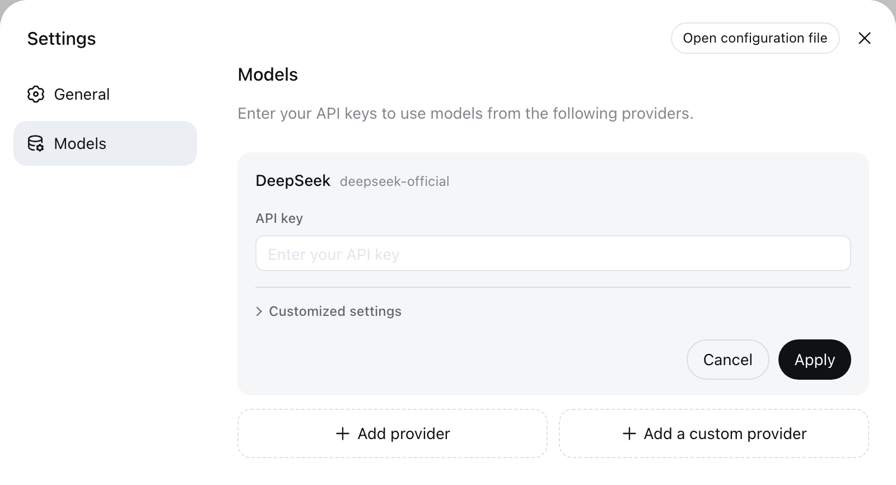

# Configure models

This guide assumes you started the Web UI through the [root README](../../../README.md#run). Model changes take effect on the next request without restarting the server.

## Configure DeepSeek

Open **Settings → Models**. The DeepSeek card exposes one API-key field; enter the key and save it.

Keys are write-only. The page receives a redacted descriptor after saving, never the literal secret. The key is stored in `$FREDDIE_HOME/.credentials.yaml`, while settings retain only its credential reference.

Under **Model catalog**, DeepSeek's shipped id/name/context-window catalog is used as-is; the page has no field to add or override a model for this provider.

## Select a model

Configured providers appear in the model picker. Selecting a model also makes it the default for new sessions. A session that has already sent a request retains the model recorded in its own log.

If a saved default names a provider that was deleted, the composer displays **Select model** and blocks input until another model is selected.

## Troubleshooting

- **`MISSING_CREDENTIAL`** — Store the provider key through the Models page or supply the referenced environment variable.
- **`UNKNOWN_MODEL`** — Select a configured model.
- **An image is refused before sending** — DeepSeek's chat-completions route is text-only and cannot be configured otherwise.

## Advanced configuration

The generated [plugin configuration catalog](../../config-catalog.md) lists every supported field and default for every plugin; the [`dsh-llm-deepseek`](../../../packages/llm/llm-deepseek/README.md) reference owns direct `settings.yaml` configuration, catalog resolution, reasoning controls, credentials, and adapter errors.
