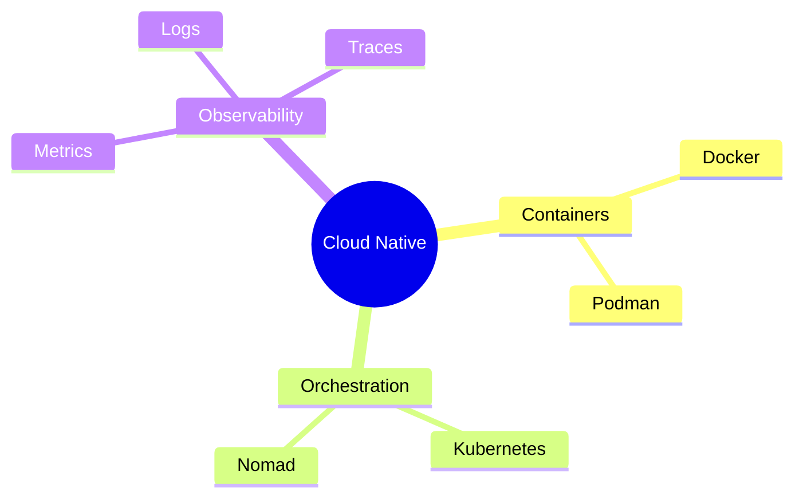
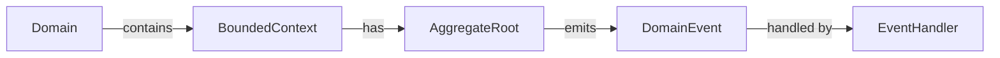
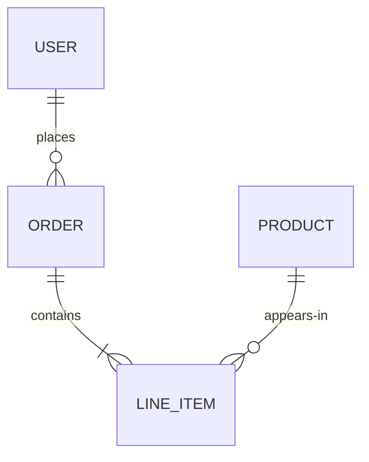

# Concept Diagrams

Extract structure from free-form descriptions and render as concept maps, mind maps, or entity-relationship diagrams.

## Diagram types

### Mind map (Mermaid mindmap)
Hierarchical, radiating from a central concept. Use when exploring a topic.

### Concept map (Mermaid graph)
Nodes connected by labelled relationships.

### ER diagram (Mermaid erDiagram)

## Process

1. Identify **nouns** (entities/concepts) and **verbs** (relationships/actions).
2. Choose diagram type: hierarchy → mindmap, relationships → concept map, data model → ER.
3. Assign cardinalities for ER, labels for concept maps, levels for mind maps.
4. Produce the diagram with a brief explanation of key relationships.

## Rules

- Every edge must have a label.
- Keep node names ≤3 words; longer names in `""`.
- Do not add nodes not mentioned unless structurally necessary.
- For ER: include primary keys when schema details are provided.

Produce the diagram immediately from the user's description.
